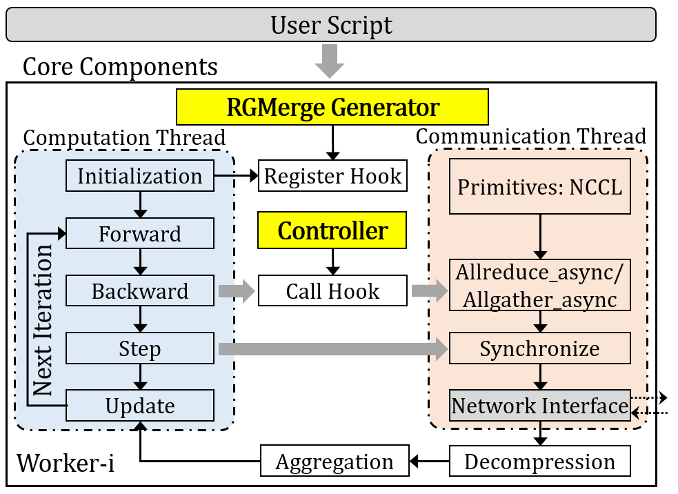

# RGMerge

__RGMerge__ is a new resilient gradient merging mechanism for boosting sparse communication. We design an inter-worker resilient gradient merging method, which allows different workers to merge the same amount of ready gradients into buffers instead of fixed inter-worker buffer sizes in the same merge phase, so as to avoid long synchronization waiting across all workers. We also design an intra-worker resilient gradient merging method, which allows the buffer size of different merge phases to be variable instead of fixed intra-worker buffer sizes, so as to adaptively overlap the sparse communication and merge phases completely to reduce multiple intra-worker waiting periods. This repository contains __RGMerge__’s source code, as well as a set of benchmarking scripts for some popular open-source data-parallel distributed DNN training systems with state-of-the-art gradient merging schemes.

# Introduction

This code repository covers:

### RGMerge

- __RGMerge__ with a quantity-based inter-worker buffering method to control the consistency of the gradient type and number buffered by inter-worker during each gradient merging.
- An adaptive intra-worker buffering method that maximizes the overlap of computations and communications.

### State-of-the-art gradient merging schemes.

- [Horovod](https://github.com/horovod/horovod)
- [SyncEA](https://dl.acm.org/doi/pdf/10.1145/3126908.3126912)
- [OMGS](https://github.com/HKBU-HPML/OMGS-SGD)
- [DeAR](https://github.com/lzhangbv/dear_pytorch?tab=readme-ov-file)

### State-of-the-art sparsification methods.

- [DGC](https://arxiv.org/pdf/1712.01887.pdf)
- [Gaussiank](https://arxiv.org/pdf/1911.08772.pdf)
- [Redsync](https://www.sciencedirect.com/science/article/pii/S0743731518308657)
- [SIDCo](https://proceedings.mlsys.org/paper_files/paper/2021/file/fea47a8aa372e42f3c84327aec9506cf-Paper.pdf)

# Implementation

We use the PyTorch framework and implemented the prototype system of __RGMerge__ based on the [Horovod](https://github.com/horovod/horovod) framework using NCCL as the communication library. The overview of our system is as follows.

<!--  -->
<center class ='img'>

</center>

# Installation

## **Prerequisites**

- CUDA-11.6
- NCCL-2.8.3
- PyTorch-1.3.+
- [OpenMPI-4.0.+](https://www-lb.open-mpi.org/software/ompi/v4.0/)
- [Horovod-0.27.+](https://github.com/horovod/horovod)

## Get the code

```
git clone https://github.com/ATC24-RGMerge/RGMerge.git
cd RGMerge
pip install -r requirements.txt
HOROVOD_GPU_OPERATIONS=NCCL pip install horovod==0.28.0
```

if pip installation fails, please try to upgrade pip via `pip install --upgrade pip`. If [Horovod](https://github.com/horovod/horovod) installation with NCCL failed, please check the installation [guide](https://horovod.readthedocs.io/en/stable/install_include.html).

## Quick start

To run CV jobs:

```
cd example/cv
bash run_imagenet_resnet152.sh
```

To run NLP jobs:

```
cd example/nlp/bert/scripts
bash run_squad_bert.sh
```
```
cd example/nlp/gpt
bash run_clm_no_trainer_hvd_103.sh
```

## Papers

RGMerge: Resilient Gradient Merging for Boosting Sparse Communication in Distributed Training Systems

## Referred Datasets

- CIFAR-100: [https://www.cs.utoronto.ca/~kriz/cifar.html](https://www.cs.utoronto.ca/~kriz/cifar.html)
- ImageNet: [https://www.image-net.org/](https://www.image-net.org/)
- Wikitex-2/103: [https://huggingface.co/datasets/wikitext](https://huggingface.co/datasets/wikitext)
- SQuAD: [https://rajpurkar.github.io/SQuAD-explorer/](https://rajpurkar.github.io/SQuAD-explorer/)

## License

See [LICENSE](https://github.com/ATC24-RGMerge/RGMerge/blob/main/LICENSE.txt).
